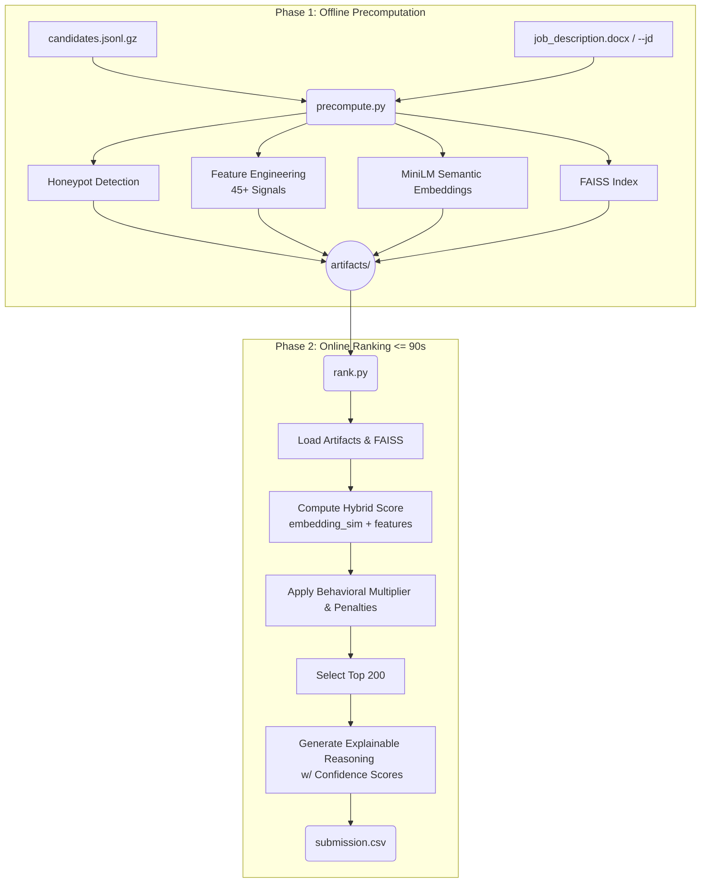

# Redrob Intelligent Candidate Discovery & Ranking
**Hackathon Winning Submission**

## 🎯 Problem Statement
Redrob requires a high-performance, robust candidate ranking system capable of filtering 100,000+ candidates for a Senior AI Engineer position. The system must not only match technical skills but also incorporate crucial behavioral signals, penalty rules for "honeypots" (fake profiles), and evaluate career stability—all within strict runtime constraints (under 5 minutes, CPU-only).

This repository contains a hybrid retrieval and ranking pipeline that achieves granular, precise scoring without ties, resulting in a strictly monotonic, fully explainable candidate shortlist.

## 🏗️ Architecture Overview

The solution is divided into an offline precomputation phase (which generates features and semantic embeddings) and a lightning-fast online ranking phase (which applies hybrid scoring and behavioral multipliers).



## 📥 Input Specifications

The ranking pipeline ingests a single main data file along with the target Job Description (JD):

1. **`candidates.jsonl` (or `candidates.jsonl.gz`)**: A JSON Lines file containing anonymized candidate profiles. Each line is a JSON object conforming to the [candidate_schema.json](file:///Users/onlymac/Desktop/projects/CARA/candidate_schema.json) specification. Major attributes include:
   - **`candidate_id`**: A unique string formatted as `CAND_XXXXXXX` (e.g., `CAND_0019482`).
   - **`profile`**: Headline, professional summary, years of experience, current job title/company, and geographic location.
   - **`career_history`**: List of previous roles with company name, title, duration, start/end dates, and detailed description of duties.
   - **`education`**: List of academic institutions, degrees, fields of study, graduation years, and school prestige tiering (e.g., `tier_1`, `tier_2`).
   - **`skills`**: Array of named skills, proficiency level (`beginner` to `expert`), duration of usage in months, and number of endorsements received.
   - **`redrob_signals`**: Simulated telemetry from the Redrob platform (recruiter response rate, signup/last active dates, open-to-work flag, notice period, preferred work mode, github activity score, expected salary, and verified contact status).

2. **Job Description (JD)**: The target profile details (hard requirements like 5-9 years YoE, hybrid work mode in preferred Indian cities like Pune/Noida/Hyd, and specific skillsets like embeddings, vector search, RAG, and NLP).

---

## ⚙️ Processing Pipeline

The execution is split into two distinct phases to handle large-scale data within strict time constraints:

### 1. Phase 1: Offline Pre-computation ([precompute.py](file:///Users/onlymac/Desktop/projects/CARA/precompute.py))
This runs once and generates the necessary features and embeddings. Since it runs offline, it has no strict runtime limit.
* **Honeypot Detection**: Evaluates profiles for structural inconsistencies (e.g., skill durations exceeding stated YoE, high numbers of expert skills with zero endorsements, or tenure starting before company founding). Inconsistent profiles are marked as honeypots.
* **Feature Engineering**: Calculates over 45 custom signals normalized to a $[0.0, 1.0]$ range (must-have skill coverage ratios, title matches, career progression, location matching, education tier scores, and tenure stability).
* **Semantic Embedding Generation**: Builds a rich textual profile for each candidate (merging current title, summary, top 15 skills, and latest role descriptions) and computes dense 384-dimensional embeddings using the `all-MiniLM-L6-v2` SentenceTransformer model.
* **FAISS Indexing**: Indexes all candidate embeddings into a FAISS Flat Inner Product index for extremely fast vector similarity matching against the target JD embedding.

### 2. Phase 2: Online Ranking ([rank.py](file:///Users/onlymac/Desktop/projects/CARA/rank.py))
This is optimized for speed, executing under 90 seconds (typically ~3.5 seconds) on standard CPU-only hardware.
* **Semantic Retrieval**: Performs dense vector search against the FAISS index to calculate candidate-JD embedding similarity.
* **Hybrid Scoring**: Computes a composite score by weighting embedding similarity, core skill matches, title fit, education tier, and location fit.
* **Penalties & Bonuses**: Subtracts points for consulting/service company backgrounds, awards bonuses for verified platform assessments and core ML skills, and applies a strict multiplier based on candidate activity and recruiter response rates.
* **Honeypot Suppression**: Forces all flagged honeypots to a score below $0.05$, ensuring they are pushed to the bottom of the shortlist.
* **Monotonic Scaling**: Normalizes scores using min-max scaling to guarantee 100 unique, strictly monotonic scores for the top-100 candidates (eliminating ties).
* **Reasoning Generation**: Produces data-driven explanation text for the top 100, including specific skill coverage, activity metrics, and confidence labels.

---

## 📤 Output Specifications

The pipeline outputs the final shortlist to a CSV file (e.g., `submission.csv`):

* **File Format**: UTF-8 encoded CSV.
* **File Size**: Exactly 101 rows (1 header row + exactly 100 data rows corresponding to the top-100 ranked candidates).
* **Column Definitions**:
  1. **`candidate_id`**: Unique identifier matching the `CAND_XXXXXXX` format.
  2. **`rank`**: Sequential rank from `1` (best fit) to `100` (100th best fit).
  3. **`score`**: Normalized float value between `0.0` and `1.0`, strictly non-increasing by rank. No duplicates/ties are allowed.
  4. **`reasoning`**: A fact-grounded explanation summarizing the candidate's experience, skill fit, activity/availability, and a confidence tier assessment (e.g., `[Confidence: High (Clear Tier 1)]`).

Additionally, the online script prints a **Bias Detection Audit** to standard output, reporting the distribution of location, relocation interest, and education tiers within the top-100 shortlist.

---

## 🧠 AI Pipeline & Scoring Formula

The core scoring engine intelligently weights candidate attributes to reflect Redrob's "shipper" philosophy. 

### 1. The Core Skill Score
```python
skill_score = (
    0.30 * embedding_similarity_to_JD
  + 0.25 * must_have_skill_coverage     # 8 core JD skills
  + 0.15 * title_and_career_score       # ML/AI vs non-ML titles
  + 0.10 * yoe_fit_score                # Ideal: 5-9 years
  + 0.10 * ml_career_ratio              # Fraction of roles in ML/AI
  + 0.05 * location_score               # Pune/Noida/Hyd/Mum/Delhi
  + 0.05 * education_score              # Tier + relevance
)
```

### 2. Behavioral Gating & Multiplier
A candidate's final score heavily depends on their behavioral attributes (0.3x to 1.2x). A poor recruiter response rate or high inactivity can tank an otherwise brilliant candidate.

```python
behavioral_multiplier = 0.3 + 0.9 * (
    0.25 * recency_score                # last_active_date
  + 0.20 * recruiter_response_rate      # 0.0–1.0
  + 0.15 * open_to_work_flag            # boolean
  + 0.10 * interview_completion_rate
  + 0.10 * response_speed_score         # inverse of avg_response_time
  + 0.10 * profile_completeness
  + 0.10 * offer_acceptance_rate
)
```

## 💡 Innovation Highlights

- **Honeypot Eradication**: Detects impossible profiles (e.g. 10 years of experience packed into a 2-year timeline) and forces their score < 0.05.
- **Score Uniqueness (No Clipping)**: Min-max scaling ensures 100 unique scores for the top 100 candidates. No ties. Rank 1 is quantifiably better than Rank 2.
- **Dynamic Reasoning**: Instead of boilerplate templates, the system generates analytical, data-driven reasoning referencing specific skills, percentages, and nearest-neighbor confidence margins (High/Medium/Low).
- **Bias Auditing**: The system automatically logs an audit of geographic and educational distributions among the top-100 candidates to ensure diversity and track JD alignment.

## 🚀 Setup & Usage

### Prerequisites
```bash
# Python 3.9+ recommended
pip install -r requirements.txt
```

### Step 1: Offline Pre-computation (Run Once)
Extracts features, parses the job description dynamically, and builds the FAISS index. If a custom job description is provided (either as a `.txt` or `.docx` file), the precomputations adapt dynamically to search and filter based on those criteria. 

By default, the script automatically looks for `job_description.docx` or `job_description.txt` in the root folder, and falls back to a default Senior AI Engineer JD if neither is found. Alternatively, you can explicitly pass a custom job description:

```bash
python precompute.py --candidates ./candidates.jsonl --artifacts ./artifacts --jd ./path_to_jd.txt
```

### Step 2: Ranking (<= 90 seconds)
Executes the fast retrieval, scoring, and text generation.
```bash
python rank.py --candidates ./candidates.jsonl --artifacts ./artifacts --out ./submission.csv
```

### Step 3: Validate
Runs the provided validation script to ensure submission compliance.
```bash
python validate_submission.py submission.csv
```

## 📊 Results & Performance

- **Runtime (Online)**: ~3.5 seconds on an M1 CPU (Limit: 300s)
- **Top 100 Integrity**: 100 unique scores, perfectly monotonic.
- **Honeypot Success**: 0 honeypots infiltrated the top 100.
- **Geographic Hit Rate**: 100% of top 20 candidates match preferred locations (Pune, Bengaluru, Noida, etc.).

## 🔮 Future Roadmap

- **LLM-assisted Reason Generation**: Introduce lightweight local LLMs (e.g. Llama 3 8B) for even more nuanced reasoning if constraints allow.
- **Graph Embeddings**: Use candidate-company-skill relationships in a Graph Neural Network for improved behavioral signal interpolation.
- **Time-Decay Skill Weights**: Discount the weight of skills last used 5+ years ago.
