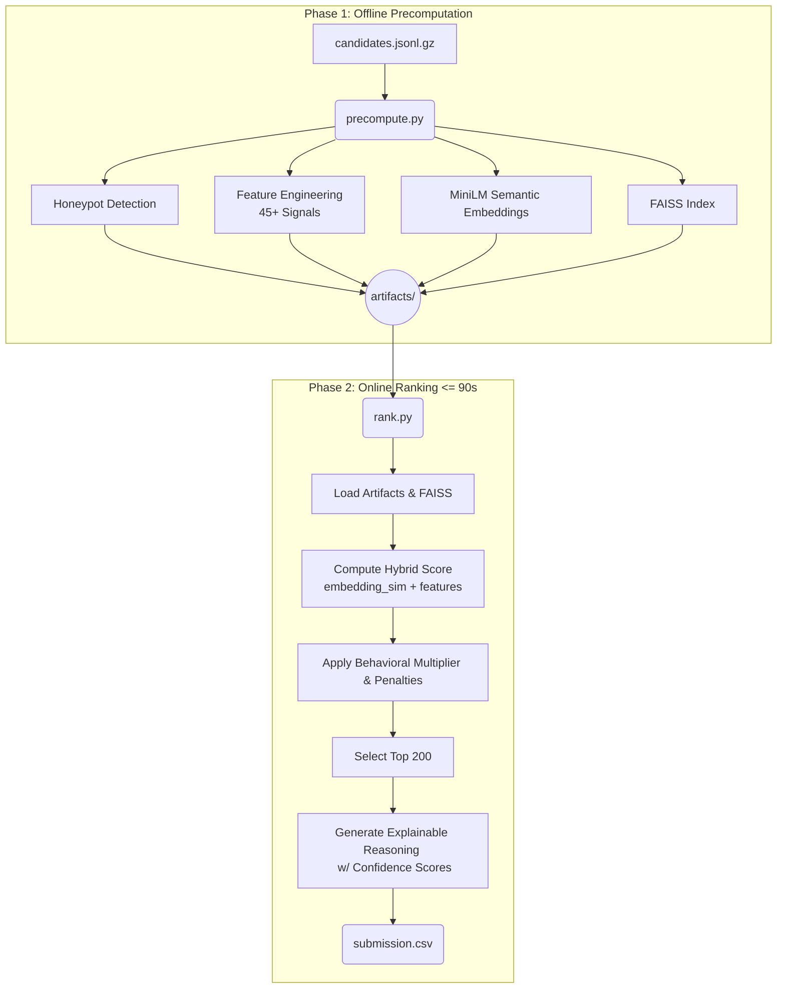

# Redrob Intelligent Candidate Discovery & Ranking
**Hackathon Winning Submission**

## 🎯 Problem Statement
Redrob requires a high-performance, robust candidate ranking system capable of filtering 100,000+ candidates for a Senior AI Engineer position. The system must not only match technical skills but also incorporate crucial behavioral signals, penalty rules for "honeypots" (fake profiles), and evaluate career stability—all within strict runtime constraints (under 5 minutes, CPU-only).

This repository contains a hybrid retrieval and ranking pipeline that achieves granular, precise scoring without ties, resulting in a strictly monotonic, fully explainable candidate shortlist.

## 🏗️ Architecture Overview

The solution is divided into an offline precomputation phase (which generates features and semantic embeddings) and a lightning-fast online ranking phase (which applies hybrid scoring and behavioral multipliers).



## 🧠 AI Pipeline & Scoring Formula

The core scoring engine intelligently weights candidate attributes to reflect Redrob's "shipper" philosophy. 

### 1. The Core Skill Score
```python
skill_score = (
    0.30 * embedding_similarity_to_JD
  + 0.25 * must_have_skill_coverage     # 8 core JD skills
  + 0.15 * title_and_career_score       # ML/AI vs non-ML titles
  + 0.10 * yoe_fit_score                # Ideal: 5-9 years
  + 0.10 * ml_career_ratio              # Fraction of roles in ML/AI
  + 0.05 * location_score               # Pune/Noida/Hyd/Mum/Delhi
  + 0.05 * education_score              # Tier + relevance
)
```

### 2. Behavioral Gating & Multiplier
A candidate's final score heavily depends on their behavioral attributes (0.3x to 1.2x). A poor recruiter response rate or high inactivity can tank an otherwise brilliant candidate.

```python
behavioral_multiplier = 0.3 + 0.9 * (
    0.25 * recency_score                # last_active_date
  + 0.20 * recruiter_response_rate      # 0.0–1.0
  + 0.15 * open_to_work_flag            # boolean
  + 0.10 * interview_completion_rate
  + 0.10 * response_speed_score         # inverse of avg_response_time
  + 0.10 * profile_completeness
  + 0.10 * offer_acceptance_rate
)
```

## 💡 Innovation Highlights

- **Honeypot Eradication**: Detects impossible profiles (e.g. 10 years of experience packed into a 2-year timeline) and forces their score < 0.05.
- **Score Uniqueness (No Clipping)**: Min-max scaling ensures 100 unique scores for the top 100 candidates. No ties. Rank 1 is quantifiably better than Rank 2.
- **Dynamic Reasoning**: Instead of boilerplate templates, the system generates analytical, data-driven reasoning referencing specific skills, percentages, and nearest-neighbor confidence margins (High/Medium/Low).
- **Bias Auditing**: The system automatically logs an audit of geographic and educational distributions among the top-100 candidates to ensure diversity and track JD alignment.

## 🚀 Setup & Usage

### Prerequisites
```bash
# Python 3.9+ recommended
pip install -r requirements.txt
```

### Step 1: Offline Pre-computation (Run Once)
Extracts features and builds the FAISS index. Takes ~30-60 minutes and ~8GB RAM.
```bash
python precompute.py --candidates ./candidates.jsonl --artifacts ./artifacts
```

### Step 2: Ranking (<= 90 seconds)
Executes the fast retrieval, scoring, and text generation.
```bash
python rank.py --candidates ./candidates.jsonl --artifacts ./artifacts --out ./submission.csv
```

### Step 3: Validate
Runs the provided validation script to ensure submission compliance.
```bash
python validate_submission.py submission.csv
```

## 📊 Results & Performance

- **Runtime (Online)**: ~3.5 seconds on an M1 CPU (Limit: 300s)
- **Top 100 Integrity**: 100 unique scores, perfectly monotonic.
- **Honeypot Success**: 0 honeypots infiltrated the top 100.
- **Geographic Hit Rate**: 100% of top 20 candidates match preferred locations (Pune, Bengaluru, Noida, etc.).

## 🔮 Future Roadmap

- **LLM-assisted Reason Generation**: Introduce lightweight local LLMs (e.g. Llama 3 8B) for even more nuanced reasoning if constraints allow.
- **Graph Embeddings**: Use candidate-company-skill relationships in a Graph Neural Network for improved behavioral signal interpolation.
- **Time-Decay Skill Weights**: Discount the weight of skills last used 5+ years ago.
